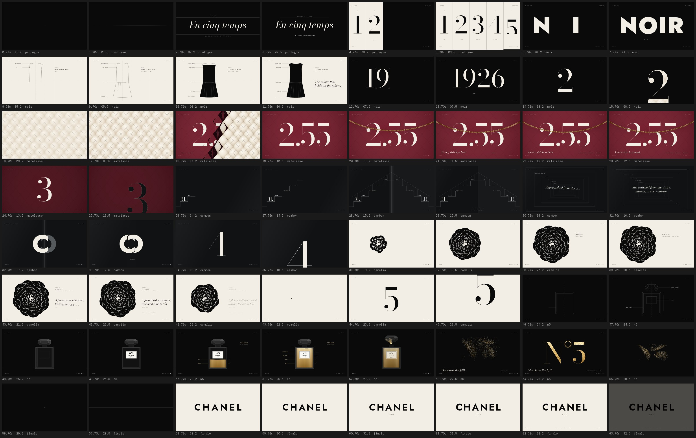
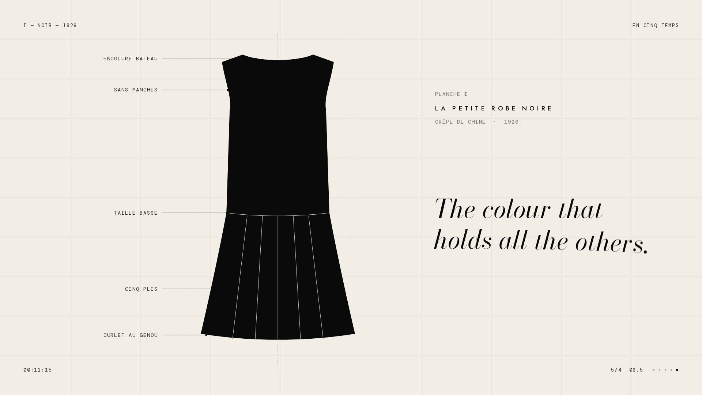
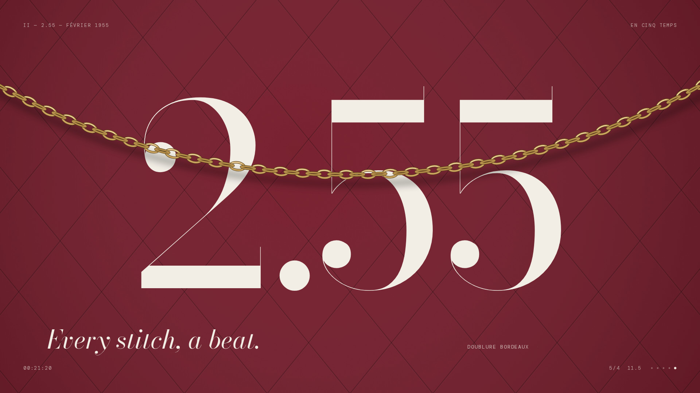
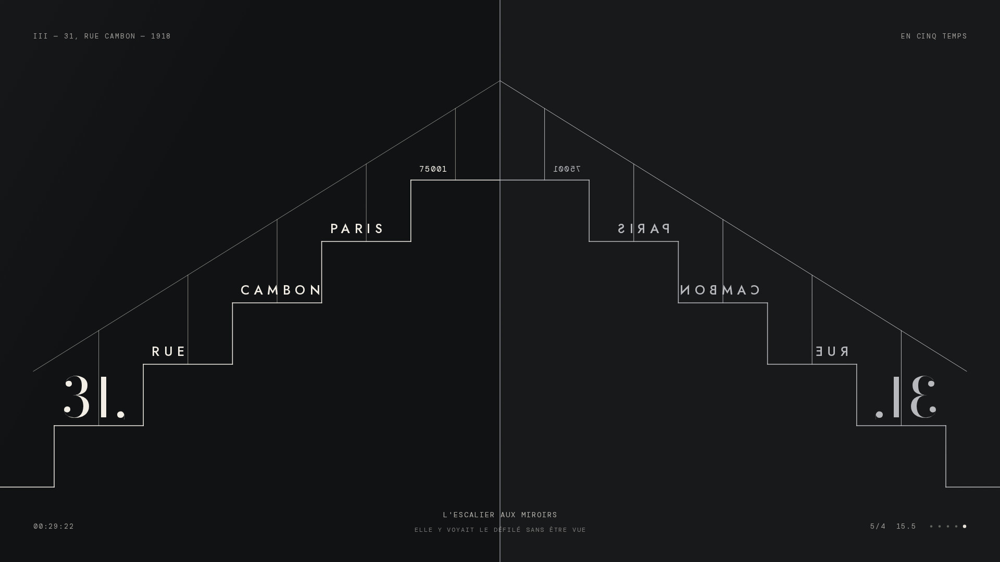
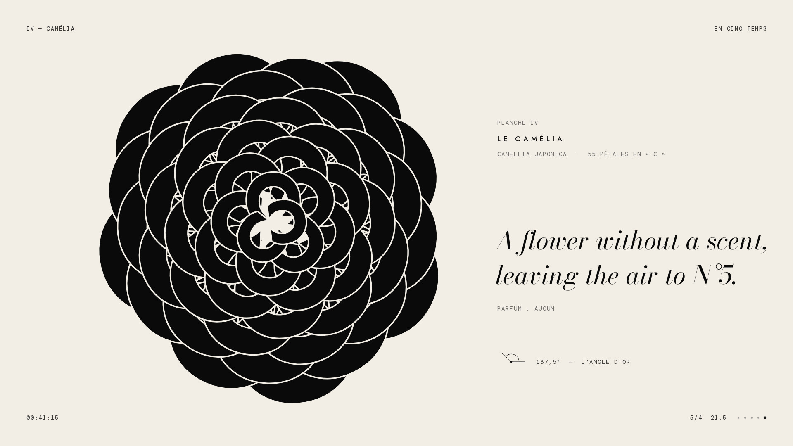
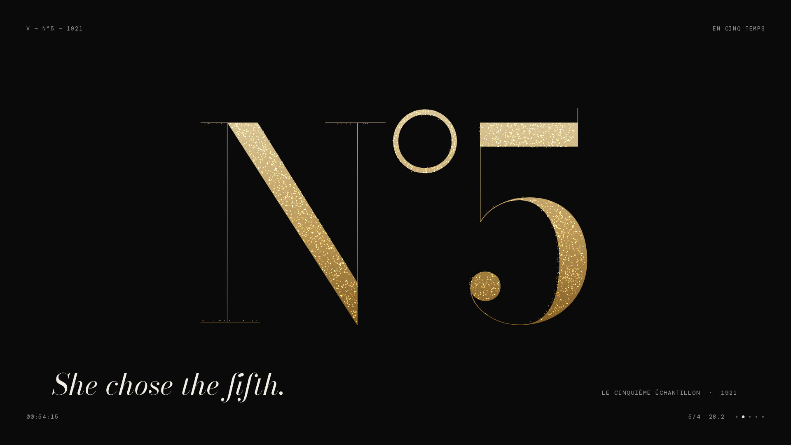
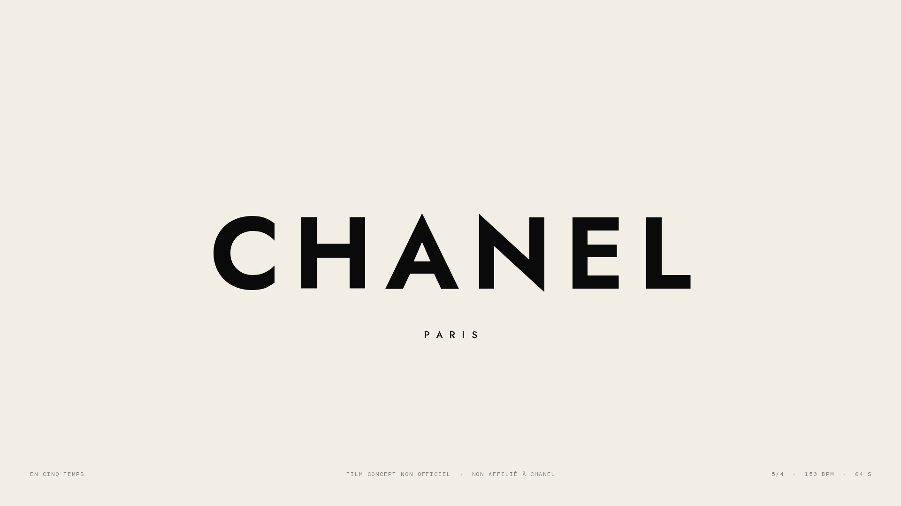

# CHANEL — *En cinq temps*

**五拍** · 非官方概念片 · 作品集压轴作品
64 秒 · 5/4 拍 · 150 BPM · 25 fps · 1920×1080

> 一部数到五的影片。五个乐章，每个乐章五小节，每小节五拍。
> 它最终停在一直要去的地方：N°5。



| I · NOIR | II · 2.55 | III · 31, RUE CAMBON |
|---|---|---|
|  |  |  |
| **IV · CAMÉLIA** | **V · N°5** | **FIN** |
|  |  |  |

- 成片：[`media/chanel-en-cinq-temps.mp4`](media/chanel-en-cinq-temps.mp4)（H.264 + AAC，真实运动模糊）
- 交互版：直接用浏览器打开 [`index.html`](index.html)，`file://` 下也能播放，无需联网、无需构建
- 分镜总览：[`media/contact-sheet.jpg`](media/contact-sheet.jpg)，关键帧：[`media/frames/`](media/frames/)

---

## 一句话概念

法语 *temps* 同时指「时间」和音乐里的「拍」。*En cinq temps* 既是「分五个乐章」，也是「五拍子」。整部片用 5/4 拍写成，因为 5 是 Chanel 的数字。节奏不是为画面配乐，节奏本身就是结构。

## 导演阐述

**从一个点开始。** 黑场里出现一个点（*le point*），拉成一根线，线被拨响后张开成一道缝，缝里是片名。缝在强拍上合拢，接着是倒数：五列、五个数字、五拍，一拍一个。

五个乐章各自回答一个问题：*同一个系统，能不能容纳五种完全不同的运动？*

| 乐章 | 主题 | 运动语言 | 核心设计 |
|---|---|---|---|
| **I · NOIR** | 小黑裙，1926 | 线与填充（*Line & Fill*） | 倒数在强拍反相；数字「1」走进单词 NOIR，变成它的 I。NOIR 用 Jost 900 排，这个字重在排版术语里就叫 **Black**。一张打版师的图纸按拍子一笔一画地画出小黑裙，墨水从下摆涨上来，镜头俯冲进黑色，找到 1926 |
| **II · 2.55** | 菱格包，1955 年 2 月 | 网格与图案（*Grid & Pattern*） | 米色小羊皮菱格，缝纫机按十六分音符一步步走线；第 5 拍皮面「鼓起」；翻牌浪潮翻出酒红内衬，同时印出 2.55；金链按悬链线（catenary）落下、摆动、阻尼静止。「*Every stitch, a beat.*」这句不是比喻：画面里每一针都是一个十六分音符 |
| **III · 31, RUE CAMBON** | 康朋街 31 号，1918 | 对称与反射（*Symmetry*） | 五级台阶一拍一级爬到画面中轴，地址写在踏步上；镜子在中轴打开，构图被自己的倒影补完成双向阶梯；随后是镜中镜的无限隧道，一拍坠入一层；最后一个 C 走向自己的倒影，两者编织咬合 |
| **IV · CAMÉLIA** | 山茶花 | 生长与旋转（*Growth*） | 山茶花完全由字母 C 构成：55 片花瓣（斐波那契数）按黄金角 137.5° 叶序排布，从中心向外开放。用的就是上一乐章在镜中咬合的那个 C。山茶花没有香味，于是花合拢回一粒种子，**种子移动到「5」的球形笔端（ball terminal）的位置，数字从这一点长出来** |
| **V · N°5** | 1921 | 光与粒子（*Light & Particles*） | 建筑立面式的瓶身构造图，一拍一个结构；玻璃显形，光扫过切面；金色液体分五拍升起，**五个音符**（*notes* 在调香里也是「香调」）从底到顶：檀香、茉莉、五月玫瑰、依兰、醛；瓶塞抬起，香迹（*sillage*）化作三条波动的金色丝带，在第 28 小节的强拍上，每一粒金粉同时落进 N°5 |

**结尾：一口气。** 所有金粉坍缩回片头那个点，然后是全片唯一一次真正的静默：连混响都被切断。点再次拉成线，线再次张开，这次缝里是光：CHANEL 在大和弦上从宽字距、失焦中合拢成形，然后是 PARIS。

### 贯穿全片的母题

- **点**：片头的点、Bodoni 数字的球形笔端（每次转场都潜入数字最「深」的一点，通常就是这颗像珍珠的球）、山茶花的种子、N°5 坍缩后的点、片尾的点。全片是一个点的往返。
- **数字转场**：每个乐章之间，下一个数字先出现，变成通往下一场景的窗口，镜头再穿过它最粗的笔画。「2」来自 1926，「5」从山茶花的种子长出。
- **C**：III 的镜中字母，IV 的花瓣。

## 节奏：一首曲子，同时也是一张时刻表

| 尺度 | 结构 | 说明 |
|---|---|---|
| 拍 | 0.4 s = 10 帧 @ 25 fps | 所有关键姿态落在拍点上（先预备，后落拍） |
| 小节 | 5 拍 = 2 s，重音 3+2（第 1、4 拍） | 与《Take Five》同一种律动 |
| 乐章 | 5 小节 = 10 s | 5 × 5 × 5 |
| 全片 | 32 小节 = 64 s | 序 3 小节 + 五乐章 25 小节 + 终章 4 小节 |

**和声就是结构。** 倒数时钟琴按拍子奏出 **D E F G A**：「一二三四五」就是小调音阶的一至五级。五个乐章的低音持续音依次是 **D、E、F、G、A**，于是整部片的低音线在乐章尺度上又弹了一遍这个动机。整部片是一个大终止式，最后在 CHANEL 上解决到 **D 大调**：那五个音终于同时响起，而 F 变成了 F♯。III 的镜子一场，动机倒着走（C B♭ A G F），镜像就是逆行。V 的金色液体用原调再奏一次动机。同一个动机在拍、乐章、和弦三个时间尺度上出现，对应画面上每个模块本身也是 16:9 的 5×5 网格。

**声音设计与画面逐帧对应：** 高跟鞋（走秀的步伐）、打版铅笔、墨水涨起的低频、1926 的快门、缝纫机的针与马达、翻牌的咔嗒、金链的叮当、镜子的「shing」、每片花瓣一声拨弦（按叶序顺序）、玻璃的泛音、倒液的气泡、香迹的气流。全部由代码合成，没有使用任何采样。

## 设计系统

- **网格**：1920×1080 分成 5×5 模块，每个模块 384×216，本身也是 16:9。按 `G` 可以叠加构造网格。
- **字体**（均为 SIL OFL）：
  - *Bodoni Moda*：Didone 衬线。可变字体的 `opsz` 轴被固定成两个家族：**Bodoni Display**（opsz 96，用于大字号，发丝线极细）和 **Bodoni Deck**（opsz 28，用于句子）；`wght` 轴保留可变。
  - *Jost*：几何无衬线，用于标题、标签和 CHANEL 字标。
  - *DM Mono*：编辑式元数据（时间码、小节/拍、图注）。
- **色彩**：Noir `#0A0A0A` · Ivoire `#F2EEE6` · Beige 皮革 · Bordeaux `#6E1020`（内衬，全片唯一的红）· Or `#C9A35E`（N°5 的金）· Argent（镜面）
- **运动曲线**（全片只用这几条，保证「一个声音」）：
  - `couture` = cubic-bezier(0.16, 1, 0.3, 1)：出现，快速出发，长长的高定式落定
  - `coupe` = (0.76, 0, 0.24, 1)：转场，干脆地切过中段
  - `soie` = (0.45, 0, 0.55, 1)：漂移与呼吸
  - `aiguille` = (0.64, 0, 0.78, 0)：加速冲向落拍（数字穿越）
- **文字层级**：法语标题（Jost，宽字距）→ 英文诗行（Bodoni Deck 斜体）→ 单色图注（DM Mono）。五个乐章的五句诗行连起来是一首诗：
  > *The colour that holds all the others. / Every stitch, a beat. / She watched from the stairs, unseen, in every mirror. / A flower without a scent, leaving the air to N°5. / She chose the fifth.*

## 技术（creative technology）

- **纯函数时间线**：每一帧都是时间 `t` 的纯函数（`FILM.render(ctx, t)`），没有任何累积状态，粒子和链条物理也是解析式。所以拖动、单帧、并行导出看到的画面完全一致。
- **画面跟随音频时钟**：播放器从 `AudioContext` 读取时间，画面永远对齐耳朵听到的拍子（已计入输出延迟）。
- **真实运动模糊**：导出时每帧是 180° 快门内多个子帧的平均。子帧数自适应：先在 1/4 分辨率下量出这一帧的运动量，静止镜头 1 个子帧，数字穿越时 32 个子帧。
- **字形即几何**：`tools/build_fonts.py` 用 fontTools 抽取字形轮廓。数字窗口、粒子目标、花瓣、CC 编织都是真正的矢量路径，可以任意放大。数字穿越的「潜入点」由距离场算出，取字形内切圆最大的圆心，保证窗口一定能吞下整个画面。
- **乐谱即代码**：`src/score.js` 用 Web Audio（FM 钟、Karplus-Strong 拨弦、减法合成 pad、噪声塑形打击乐、卷积混响、乒乓延迟）在 `OfflineAudioContext` 里离线渲染，所有随机数都有种子，结果可复现。播放器加载的是它的预渲染版（`src/score-audio.js`），加 `?synth=1` 可以在浏览器里现场重新作曲。

### 操作

| 键 | 功能 |
|---|---|
| `空格` | 播放 / 暂停 |
| `←` `→` | 逐帧（1/25 s） |
| `⇧ ←` `⇧ →` | 逐拍（0.4 s） |
| `↑` `↓` | 逐小节 |
| `0`–`6` | 跳到章节 |
| `G` | 构造网格与节拍（导演视图） |
| `H` | 元数据 HUD |
| `M` / `F` / `L` | 静音 / 全屏 / 循环 |

URL 参数：`?t=36.2`（定格到某时刻）· `?guides=1` · `?hud=0` · `?credit=你的名字`（片尾署名）· `?synth=1`

### 重新构建与导出

```bash
# 依赖：Node 18+、Playwright（含 Chromium）、Python 3 + fonttools brotli、带 libx264 的 ffmpeg
bash tools/fetch-fonts.sh && python3 tools/build_fonts.py   # 字体 → src/fonts.js, src/glyphs.js
node tools/build_audio.cjs                                  # 乐谱 → src/score-audio.js
node tools/stills.cjs --sheet media/contact-sheet.png --from 0.7 --to 64 --step 1 --cols 8
FFMPEG=/path/to/ffmpeg node tools/render.cjs                # → media/chanel-en-cinq-temps.mp4
# render.cjs 选项：--workers 4  --samples auto|N  --shutter 0.5  --scale 2（4K）  --from/--to 秒  --crf 17
```

### 文件结构

```
index.html              播放器（导演视图、章节时间线、快捷键）
src/core.js             时间网格（5/4 @ 150）、缓动、噪声、字距/字偶排版、字形、图层
src/kit.js              共享手法：细线、打字机图注、数字穿越、缝线
src/film.js             场景注册、合成、HUD、构造网格、运动模糊、颗粒
src/score.js            乐谱（合成器与编曲）
src/scenes/*.js         prologue · noir · matelasse · cambon · camelia · n5 · finale
src/fonts.js glyphs.js score-audio.js    生成的资源（不要手改）
tools/                  字体构建、单帧与分镜表、音频、成片导出
media/                  成片、分镜总览、关键帧
```

## 声明

这是一部**非官方的概念作品**（spec work），用于个人作品集，与 CHANEL 没有任何隶属、授权或背书关系。CHANEL、N°5、2.55 及相关标识均为其权利人的商标。片中字标由开源字体 Jost 排出，不是官方标志文件；瓶身、山茶花、菱格等是基于公开常识的图形化再创作。对外发布前，请自行确认你所在场景下对品牌素材的使用是否合适。

字体：Bodoni Moda、Jost、DM Mono，均以 SIL Open Font License 1.1 授权，许可文本见 [`fonts/`](fonts/)。其中 Bodoni Moda 的固定光学尺寸实例已按 OFL 要求改名为 Bodoni Display / Bodoni Deck。
